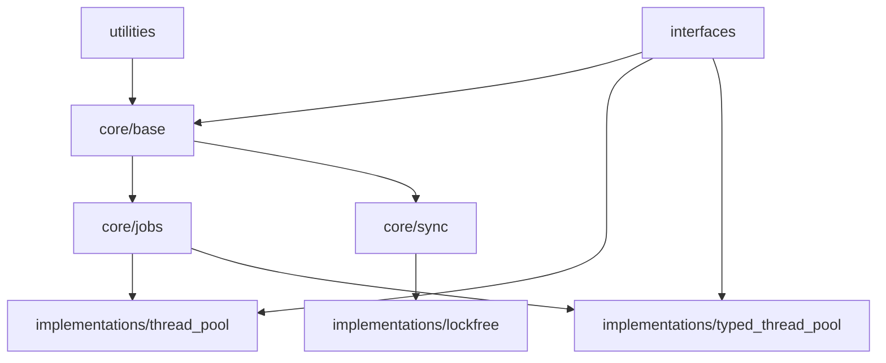

# Thread System - 설계 개선안

## 작성일
2025-09-06

## 개요
NEED_TO_FIX.md에서 식별된 문제점들을 해결하기 위한 체계적인 설계 개선안을 제시합니다.

## 1. 아키텍처 개선

### 1.1 디렉토리 구조 재정리

#### 현재 구조의 문제점
- sources와 modular_structure 디렉토리가 혼재
- interfaces 디렉토리의 역할이 불명확
- 모듈 간 의존성이 명시적이지 않음

#### 개선안
```
thread_system/
├── core/                        # 핵심 모듈
│   ├── base/                   # thread_base 관련
│   │   ├── include/
│   │   └── src/
│   ├── jobs/                   # job 시스템
│   │   ├── include/
│   │   └── src/
│   └── sync/                   # 동기화 프리미티브
│       ├── include/
│       └── src/
├── interfaces/                  # 공개 인터페이스
│   ├── logger_interface.h
│   ├── monitoring_interface.h
│   └── thread_context.h
├── implementations/             # 구현체
│   ├── thread_pool/
│   ├── typed_thread_pool/
│   └── lockfree/
├── utilities/                   # 유틸리티
├── tests/                      # 테스트
├── benchmarks/                 # 벤치마크
├── samples/                    # 예제
└── docs/                       # 문서
```

### 1.2 모듈 의존성 명확화

#### 의존성 그래프 정의


#### 의존성 규칙
1. 하위 레이어는 상위 레이어를 참조할 수 없음
2. 순환 의존성 금지
3. 인터페이스를 통한 의존성 주입 권장

## 2. 인터페이스 계층 강화

### 2.1 새로운 인터페이스 체계

#### 핵심 인터페이스
```cpp
namespace thread_system {
    // 작업 실행자 인터페이스
    class executor_interface {
    public:
        virtual ~executor_interface() = default;
        virtual auto execute(std::unique_ptr<job> work) -> result_void = 0;
        virtual auto shutdown() -> result_void = 0;
    };

    // 스케줄러 인터페이스
    class scheduler_interface {
    public:
        virtual ~scheduler_interface() = default;
        virtual auto schedule(std::unique_ptr<job> work) -> result_void = 0;
        virtual auto get_next_job() -> std::unique_ptr<job> = 0;
    };

    // 모니터링 가능한 컴포넌트 인터페이스
    class monitorable_interface {
    public:
        virtual ~monitorable_interface() = default;
        virtual auto get_metrics() -> metrics_snapshot = 0;
        virtual auto reset_metrics() -> void = 0;
    };
}
```

### 2.2 서비스 레지스트리 패턴

#### 구현 방안
```cpp
class service_registry {
private:
    static inline std::unordered_map<std::type_index, std::any> services_;
    static inline std::shared_mutex mutex_;

public:
    template<typename Interface>
    static auto register_service(std::shared_ptr<Interface> service) -> void {
        std::unique_lock lock(mutex_);
        services_[std::type_index(typeid(Interface))] = service;
    }

    template<typename Interface>
    static auto get_service() -> std::shared_ptr<Interface> {
        std::shared_lock lock(mutex_);
        auto it = services_.find(std::type_index(typeid(Interface)));
        if (it != services_.end()) {
            return std::any_cast<std::shared_ptr<Interface>>(it->second);
        }
        return nullptr;
    }
};
```

## 3. 문서화 시스템 개선

### 3.1 자동 문서 생성 체계

#### Doxygen 통합
```cmake
# CMakeLists.txt 추가
option(BUILD_DOCUMENTATION "Build documentation" ON)

if(BUILD_DOCUMENTATION)
    find_package(Doxygen REQUIRED)
    
    set(DOXYGEN_GENERATE_HTML YES)
    set(DOXYGEN_GENERATE_MAN NO)
    set(DOXYGEN_OUTPUT_DIRECTORY ${CMAKE_CURRENT_BINARY_DIR}/docs)
    set(DOXYGEN_EXTRACT_ALL YES)
    set(DOXYGEN_EXTRACT_PRIVATE YES)
    
    doxygen_add_docs(
        docs
        ${CMAKE_CURRENT_SOURCE_DIR}/sources
        COMMENT "Generating API documentation"
    )
endif()
```

### 3.2 문서 구조 표준화

#### 각 모듈별 README 템플릿
```markdown
# 모듈명

## 개요
모듈의 목적과 주요 기능 설명

## 아키텍처
모듈의 내부 구조와 설계 원칙

## API 참조
주요 클래스와 함수 설명

## 사용 예제
실제 사용 코드 예제

## 성능 특성
벤치마크 결과와 최적화 팁

## 의존성
필요한 다른 모듈과 외부 라이브러리
```

## 4. 테스트 및 품질 보증

### 4.1 테스트 커버리지 목표

#### 커버리지 기준
- 코드 커버리지: 최소 80%
- 브랜치 커버리지: 최소 70%
- 핵심 모듈(core): 90% 이상

#### 테스트 자동화
```cmake
# 테스트 커버리지 측정
if(ENABLE_COVERAGE)
    set(CMAKE_CXX_FLAGS "${CMAKE_CXX_FLAGS} --coverage")
    set(CMAKE_EXE_LINKER_FLAGS "${CMAKE_EXE_LINKER_FLAGS} --coverage")
    
    add_custom_target(coverage
        COMMAND lcov --capture --directory . --output-file coverage.info
        COMMAND lcov --remove coverage.info '/usr/*' --output-file coverage.info
        COMMAND lcov --list coverage.info
        COMMAND genhtml coverage.info --output-directory coverage_report
        WORKING_DIRECTORY ${CMAKE_BINARY_DIR}
    )
endif()
```

### 4.2 성능 벤치마크 자동화

#### 벤치마크 프레임워크
```cpp
class benchmark_suite {
public:
    struct result {
        std::string name;
        double throughput;
        double latency_ns;
        double memory_mb;
    };

    template<typename Func>
    static auto run(const std::string& name, Func&& func, size_t iterations = 1000000) -> result {
        auto start = std::chrono::high_resolution_clock::now();
        
        for (size_t i = 0; i < iterations; ++i) {
            func();
        }
        
        auto end = std::chrono::high_resolution_clock::now();
        auto duration = std::chrono::duration_cast<std::chrono::nanoseconds>(end - start);
        
        return {
            .name = name,
            .throughput = static_cast<double>(iterations) / duration.count() * 1e9,
            .latency_ns = static_cast<double>(duration.count()) / iterations,
            .memory_mb = get_memory_usage_mb()
        };
    }
};
```

## 5. 빌드 시스템 개선

### 5.1 모듈화된 CMake 구성

#### 모듈별 CMakeLists.txt
```cmake
# core/CMakeLists.txt
add_library(thread_system_core STATIC)

target_sources(thread_system_core
    PRIVATE
        base/src/thread_base.cpp
        jobs/src/job.cpp
        sync/src/sync_primitives.cpp
)

target_include_directories(thread_system_core
    PUBLIC
        $<BUILD_INTERFACE:${CMAKE_CURRENT_SOURCE_DIR}/base/include>
        $<BUILD_INTERFACE:${CMAKE_CURRENT_SOURCE_DIR}/jobs/include>
        $<BUILD_INTERFACE:${CMAKE_CURRENT_SOURCE_DIR}/sync/include>
        $<INSTALL_INTERFACE:include>
)

# 설치 규칙
install(TARGETS thread_system_core
    EXPORT thread_system_targets
    LIBRARY DESTINATION lib
    ARCHIVE DESTINATION lib
    RUNTIME DESTINATION bin
)
```

### 5.2 패키지 구성

#### CMake 패키지 파일
```cmake
# ThreadSystemConfig.cmake.in
@PACKAGE_INIT@

include("${CMAKE_CURRENT_LIST_DIR}/ThreadSystemTargets.cmake")

check_required_components(ThreadSystem)

# 제공되는 컴포넌트
set(ThreadSystem_COMPONENTS
    Core
    ThreadPool
    TypedThreadPool
    Utilities
)
```

## 6. 코딩 표준 통일

### 6.1 명명 규칙 정리

#### 통일된 규칙
- 클래스: `snake_case` (예: `thread_base`)
- 함수: `snake_case` (예: `get_worker_count`)
- 멤버 변수: `snake_case_` (예: `worker_count_`)
- 템플릿 클래스: `snake_case` (접미사 불필요)
- 인터페이스: `snake_case_interface` (예: `logger_interface`)

### 6.2 코드 포매터 설정

#### .clang-format 파일
```yaml
BasedOnStyle: Google
IndentWidth: 4
TabWidth: 4
UseTab: Never
ColumnLimit: 100
PointerAlignment: Left
AlignAfterOpenBracket: Align
AllowShortFunctionsOnASingleLine: Empty
BreakConstructorInitializers: BeforeComma
```

## 7. 실행 계획

### Phase 1: 기초 작업 (1주)
1. 디렉토리 구조 재정리
2. CMake 빌드 시스템 개선
3. 기본 문서 템플릿 작성

### Phase 2: 인터페이스 개선 (2주)
1. 새로운 인터페이스 정의
2. 서비스 레지스트리 구현
3. 기존 코드 리팩토링

### Phase 3: 문서화 (1주)
1. Doxygen 통합
2. 각 모듈별 README 작성
3. API 문서 생성

### Phase 4: 품질 보증 (2주)
1. 테스트 커버리지 측정 시스템 구축
2. 벤치마크 자동화
3. CI/CD 파이프라인 개선

### Phase 5: 마무리 (1주)
1. 코드 리뷰 및 수정
2. 최종 문서 검토
3. 릴리즈 준비

## 8. 기대 효과

1. **유지보수성 향상**: 명확한 모듈 구조와 의존성 관리
2. **확장성 개선**: 인터페이스 기반 설계로 새로운 구현 추가 용이
3. **문서 품질 향상**: 자동 생성과 표준화된 템플릿
4. **테스트 신뢰성**: 커버리지 측정과 자동화된 테스트
5. **성능 투명성**: 자동화된 벤치마크와 지속적 모니터링
6. **개발 생산성**: 명확한 가이드라인과 도구 지원

## 9. 리스크 관리

### 잠재적 리스크
1. **API 변경**: 기존 사용자 코드 호환성 문제
   - 대응: 마이그레이션 가이드 제공, deprecated 마킹 사용
   
2. **성능 저하**: 인터페이스 추가로 인한 오버헤드
   - 대응: 인라인 최적화, 템플릿 활용
   
3. **빌드 복잡도 증가**: 모듈화로 인한 빌드 시간 증가
   - 대응: 프리컴파일드 헤더, 병렬 빌드 최적화

## 10. 결론

이 설계 개선안은 thread_system 프로젝트의 구조적 문제를 해결하고, 
장기적 유지보수성과 확장성을 확보하기 위한 체계적인 접근 방법을 제시합니다.
단계적 실행을 통해 리스크를 최소화하면서 품질을 향상시킬 수 있습니다.