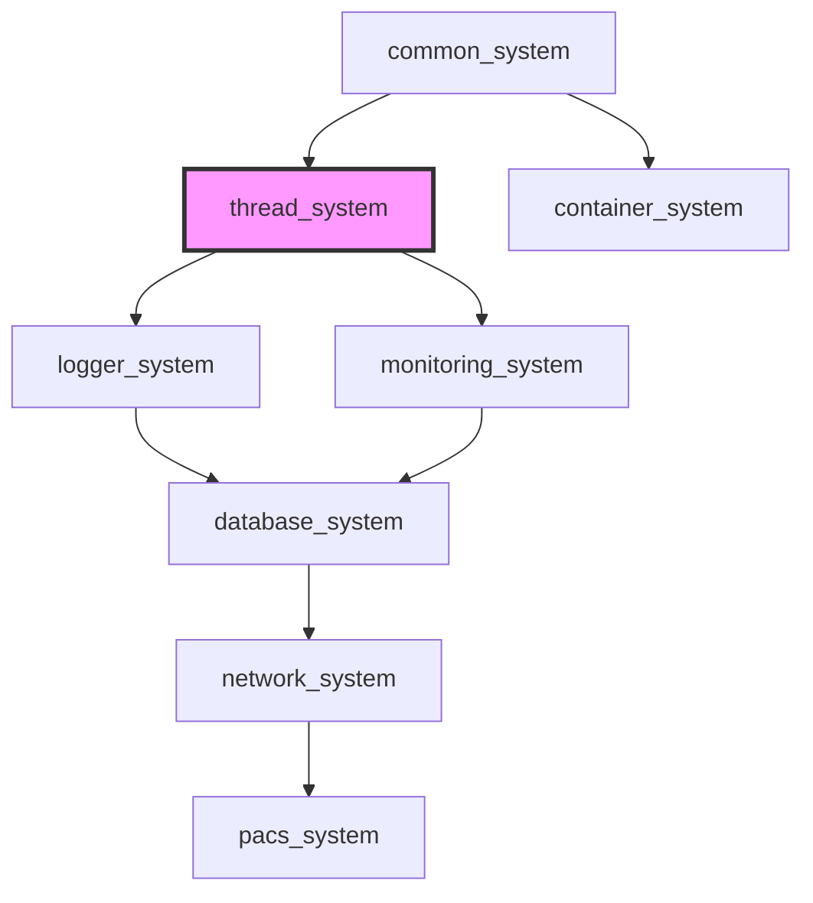

[](https://github.com/kcenon/thread_system/actions/workflows/ci.yml)
[](https://github.com/kcenon/thread_system/actions/workflows/coverage.yml)
[](https://codecov.io/gh/kcenon/thread_system)
[](https://codecov.io/gh/kcenon/thread_system)
[](https://github.com/kcenon/thread_system/actions/workflows/static-analysis.yml)
[](https://github.com/kcenon/thread_system/actions/workflows/build-Doxygen.yaml)
[](https://github.com/kcenon/thread_system/blob/main/LICENSE)

# Thread System

> **Language:** [English](README.md) | **한국어**

동시성 프로그래밍의 민주화를 위해 설계된 현대적인 C++20 멀티스레딩 프레임워크입니다.

## Table of Contents

- [Overview](#overview)
- [Quick Start](#quick-start)
- [Core Features](#core-features)
- [Performance Highlights](#performance-highlights)
- [Architecture Overview](#architecture-overview)
- [Documentation](#documentation)
- [Ecosystem Integration](#ecosystem-integration)
- [C++20 Module Support](#c20-module-support)
- [CMake Integration](#cmake-integration)
- [Examples](#examples)
- [Production Quality](#production-quality)
- [Platform Support](#platform-support)
- [Contributing](#contributing)
- [License](#license)

---

## Overview

Thread System은 고성능 thread-safe 애플리케이션 구축을 위한 직관적인 추상화와 견고한 구현을 제공하는 포괄적인 멀티스레딩 프레임워크입니다.

**핵심 가치(Key Value Propositions)**:
- **검증된 품질**: 95%+ CI/CD 성공률, ThreadSanitizer 경고 제로, 49% 코드 커버리지
- **고성능**: 초당 1.16M 작업 처리(baseline), lock-free 큐 4배 성능 향상, 적응형 최적화
- **개발자 친화적**: 직관적 API, 포괄적 문서, 풍부한 예제
- **유연한 아키텍처**: 선택적 logger/monitoring 통합이 가능한 모듈식 설계
- **크로스 플랫폼**: 다중 컴파일러를 지원하는 Linux, macOS, Windows

**최신 업데이트(Latest Updates)**:
- ✅ Queue API 간소화: 8개 구현 → 2개 공개 타입 (adaptive_job_queue, job_queue)
- ✅ Hazard Pointer 구현 완료 - lock-free 큐가 프로덕션에 안전
- ✅ Lock-free 큐로 4배 성능 향상 (71 μs vs 291 μs)
- ✅ 향상된 동기화 프리미티브 및 취소 토큰
- ✅ 모든 CI/CD 파이프라인 정상 (ThreadSanitizer 및 AddressSanitizer 클린)

---

## Quick Start

### Requirements

- **C++20 컴파일러**: GCC 13+ / Clang 17+ / MSVC 2022+
- **CMake 3.20+**
- **[common_system](https://github.com/kcenon/common_system)**: 필수 의존성 (thread_system과 나란히 클론해야 함)

> **⚠️ 하위 영향(Downstream Impact)**: thread_system에 의존하는 시스템(monitoring_system, database_system, network_system)은 이 컴파일러 요구사항을 상속합니다. 전체 생태계를 빌드할 때 컴파일러가 GCC 13+/Clang 17+를 충족하는지 확인하세요.

### Installation

```bash
# Clone repositories (common_system is required)
git clone https://github.com/kcenon/common_system.git
git clone https://github.com/kcenon/thread_system.git
cd thread_system

# Install dependencies
./scripts/dependency.sh  # Linux/macOS
./scripts/dependency.bat # Windows

# Build
./scripts/build.sh       # Linux/macOS
./scripts/build.bat      # Windows

# Run examples
./build/bin/thread_pool_sample
```

### Installation via vcpkg

```bash
vcpkg install kcenon-thread-system
```

`CMakeLists.txt`에서:
```cmake
find_package(thread_system CONFIG REQUIRED)
target_link_libraries(your_target PRIVATE kcenon::thread_system)
```

### Basic Usage

```cpp
#include <kcenon/thread/core/thread_pool.h>
#include <kcenon/thread/jobs/callback_job.h>

using namespace kcenon::thread;

int main() {
    // Create thread pool
    auto pool = std::make_shared<thread_pool>("MyPool");

    // Add workers
    std::vector<std::unique_ptr<thread_worker>> workers;
    for (size_t i = 0; i < std::thread::hardware_concurrency(); ++i) {
        workers.push_back(std::make_unique<thread_worker>());
    }
    pool->enqueue_batch(std::move(workers));

    // Start processing
    pool->start();

    // Submit jobs (convenience API)
    for (int i = 0; i < 1000; ++i) {
        pool->submit_task([i]() {
            std::cout << "Processing job " << i << "\n";
        });
    }

    // Clean shutdown
    pool->shutdown_pool(false);  // Wait for completion
    return 0;
}
```

**📖 [전체 시작 가이드 →](docs/guides/QUICK_START.md)**

---

## Core Features

### Thread Pool System
- **표준 스레드 풀(Standard Thread Pool)**: 적응형 큐를 지원하는 다중 워커 풀
- **타입드 스레드 풀(Typed Thread Pool)**: 타입 인식 라우팅을 갖춘 우선순위 기반 스케줄링
- **동적 워커 관리(Dynamic Worker Management)**: 런타임에 워커 추가/제거
- **이중 API(Dual API)**: Result 기반(상세 오류)과 편의 API(간단)

### Queue Implementations (Simplified to 2 Public Types)
Kent Beck의 Simple Design 원칙에 따라 이제 2개의 공개 큐 타입만 제공합니다:
- **Adaptive Queue** (권장): mutex와 lock-free 모드 사이를 자동 전환하는 자동 최적화 큐
- **Standard Queue**: 블로킹 대기와 정확한 크기 추적을 갖춘 Mutex 기반 FIFO(선택적 크기 제한 지원)
- **Queue Factory**: 컴파일 타임 선택을 통한 요구사항 기반 큐 생성
- **Capability Introspection**: 큐 특성(exact_size, lock_free 등)에 대한 런타임 조회

> **참고**: `bounded_job_queue`는 이제 선택적 `max_size` 파라미터를 갖춘 `job_queue`로 통합되었습니다.
> 내부 구현(`lockfree_job_queue`, `concurrent_queue`)은 `detail::` 네임스페이스에 있습니다.

### Advanced Features
- **Hazard Pointers**: Lock-free 구조를 위한 안전한 메모리 회수
- **Cancellation Tokens**: 계층적 지원을 갖춘 협력적 취소
- **Service Registry**: 경량 의존성 주입 컨테이너
- **Synchronization Primitives**: 타임아웃과 술어(predicate)를 갖춘 향상된 래퍼
- **Worker Policies**: 세밀한 제어(스케줄링, 유휴 동작, CPU 친화성)

### Error Handling
- `thread::result<T>`와 `thread::result_void`는 `common::Result`를 래핑하되 thread 전용 헬퍼를 유지합니다(`include/kcenon/thread/core/error_handling.h` 참조).
- thread_system 리포지토리 내부에서 작업할 때는 `result.has_error()` / `result.get_error()`를 사용하고, 모듈 경계를 넘을 때는 `detail::to_common_error(...)`를 통해 `common::error_info`로 변환합니다.
- 공유 문서를 갱신할 때는, 다른 시스템이 `.error()`에 의존하더라도 thread 전용 래퍼는 하위 호환성을 위해 의도적으로 `.get_error()`를 노출한다는 점을 명시하세요.

**📚 [상세 기능 →](docs/FEATURES.md)**

---

## Performance Highlights

**플랫폼**: Apple M1 @ 3.2GHz, 16GB RAM, macOS Sonoma

| 메트릭 | 값 | 구성 |
|--------|-------|---------------|
| **프로덕션 처리량** | 1.16M jobs/s | 10 워커, 실제 워크로드 |
| **타입드 풀** | 1.24M jobs/s | 6 워커, 6.9% 향상 |
| **Lock-free 큐** | 71 μs/op | Mutex 대비 4배 향상 |
| **작업 지연 (P50)** | 77 ns | 마이크로초 이하 |
| **메모리 기준선** | <1 MB | 8 워커 |
| **스케일링 효율** | 96% | 8 워커까지 |

### Queue Performance Comparison

| 큐 타입 | 지연 | 적합 대상 |
|-----------|---------|----------|
| Mutex Queue | 96 ns | 낮은 경합 (1-2 스레드) |
| Adaptive (auto) | 96-320 ns | 가변 워크로드 |
| Lock-free | 320 ns | 높은 경합 (8+ 스레드), 37% 향상 |

### Worker Scaling

| 워커 수 | 속도 향상 | 효율 | 등급 |
|---------|---------|------------|--------|
| 2 | 2.0x | 99% | 🥇 Excellent |
| 4 | 3.9x | 97.5% | 🥇 Excellent |
| 8 | 7.7x | 96% | 🥈 Very Good |
| 16 | 15.0x | 94% | 🥈 Very Good |

**⚡ [전체 벤치마크 →](docs/BENCHMARKS.md)**

---

## Architecture Overview

### Modular Design

```
┌─────────────────────────────────────────┐
│         Thread System Core              │
│  ┌───────────────────────────────────┐  │
│  │  Thread Pool & Workers            │  │
│  │  - Standard Pool                  │  │
│  │  - Typed Pool (Priority)          │  │
│  │  - Dynamic Worker Management      │  │
│  └───────────────────────────────────┘  │
│  ┌───────────────────────────────────┐  │
│  │  Queue Implementations            │  │
│  │  - Adaptive Queue (recommended)   │  │
│  │  - Standard Queue (blocking wait) │  │
│  │  - Internal: lock-free MPMC       │  │
│  └───────────────────────────────────┘  │
│  ┌───────────────────────────────────┐  │
│  │  Advanced Features                │  │
│  │  - Hazard Pointers                │  │
│  │  - Cancellation Tokens            │  │
│  │  - Service Registry               │  │
│  │  - Worker Policies                │  │
│  └───────────────────────────────────┘  │
└─────────────────────────────────────────┘

Optional Integration Projects (Separate Repos):
┌──────────────────┐  ┌──────────────────┐
│  Logger System   │  │ Monitoring System│
│  - Async logging │  │ - Real-time      │
│  - Multi-target  │  │   metrics        │
│  - High-perf     │  │ - Observability  │
└──────────────────┘  └──────────────────┘
```

### Key Components

- **thread_base**: 라이프사이클 관리를 갖춘 추상 스레드 클래스
- **thread_pool**: 적응형 큐를 갖춘 다중 워커 풀
- **typed_thread_pool**: 타입 인식 라우팅을 갖춘 우선순위 스케줄링
- **adaptive_job_queue**: 자동 최적화 큐 (권장 기본값)
- **job_queue**: 블로킹 대기 지원을 갖춘 Mutex 기반 큐
- **hazard_pointer**: Lock-free 구조를 위한 안전한 메모리 회수
- **cancellation_token**: 협력적 취소 메커니즘

**🏗️ [아키텍처 가이드 →](docs/advanced/ARCHITECTURE.md)**

---

## Documentation

### Getting Started
- 📖 [Quick Start Guide](docs/guides/QUICK_START.md) - 5분 만에 시작하기
- 🔧 [Build Guide](docs/guides/BUILD_GUIDE.md) - 상세 빌드 지침
- 🚀 [User Guide](docs/advanced/USER_GUIDE.md) - 포괄적인 사용 가이드

### Core Documentation
- 📚 [Features](docs/FEATURES.md) - 상세 기능 설명
- ⚡ [Benchmarks](docs/BENCHMARKS.md) - 포괄적인 성능 데이터
- 📋 [API Reference](docs/advanced/API_REFERENCE.md) - 완전한 API 문서
- 🏛️ [Architecture](docs/advanced/ARCHITECTURE.md) - 시스템 설계 및 내부 구조

### Advanced Topics
- 🔬 [Performance Baseline](docs/performance/BASELINE.md) - 기준선 메트릭 및 회귀 감지
- 🛡️ [Production Quality](docs/PRODUCTION_QUALITY.md) - CI/CD, 테스트, 품질 메트릭
- 🧩 [C++20 Concepts](docs/advanced/CPP20_CONCEPTS.md) - 스레드 연산을 위한 타입 안전 제약
- 📁 [Project Structure](docs/PROJECT_STRUCTURE.md) - 상세 코드베이스 구성
- ⚠️ [Known Issues](docs/advanced/KNOWN_ISSUES.md) - 현재 제약 및 우회 방법
- 📗 [Queue Selection Guide](docs/advanced/QUEUE_SELECTION_GUIDE.md) - 올바른 큐 선택
- 🔄 [Queue Backward Compatibility](docs/QUEUE_BACKWARD_COMPATIBILITY.md) - 마이그레이션 및 호환성

### Development
- 🤝 [Contributing](docs/contributing/CONTRIBUTING.md) - 기여 방법
- 🔍 [Troubleshooting](docs/guides/TROUBLESHOOTING.md) - 일반적인 문제 및 해결
- ❓ [FAQ](docs/guides/FAQ.md) - 자주 묻는 질문
- 🔄 [Migration Guide](docs/advanced/MIGRATION.md) - 이전 버전에서 업그레이드

### API Documentation (Doxygen)

```bash
cmake -S . -B build -DCMAKE_BUILD_TYPE=Release
cmake --build build --target docs
# Open documents/html/index.html
```

---

## Ecosystem Integration

### Ecosystem Dependency Map



> **생태계 참조(Ecosystem reference)**:
> [common_system](https://github.com/kcenon/common_system) — Tier 0: IExecutor 인터페이스 및 Result&lt;T&gt; 패턴
> [logger_system](https://github.com/kcenon/logger_system) — Tier 2: 비동기 로깅 (선택적 소비자)
> [monitoring_system](https://github.com/kcenon/monitoring_system) — Tier 3: 메트릭 수집 (소비자)
> [network_system](https://github.com/kcenon/network_system) — Tier 4: 전송 계층 (소비자)

### Project Ecosystem

이 프로젝트는 모듈식 생태계의 일부입니다:

```
thread_system (core interfaces)
    ↑                    ↑
logger_system    monitoring_system
    ↑                    ↑
    └── integrated_thread_system ──┘
```

### Optional Components

- **[logger_system](https://github.com/kcenon/logger_system)**: 고성능 비동기 로깅
- **[monitoring_system](https://github.com/kcenon/monitoring_system)**: 실시간 메트릭 및 모니터링
- **[integrated_thread_system](https://github.com/kcenon/integrated_thread_system)**: 완전한 통합 예제

### Integration Benefits

- **플러그 앤 플레이(Plug-and-play)**: 필요한 컴포넌트만 사용
- **인터페이스 기반(Interface-driven)**: 깔끔한 추상화로 쉬운 교체 가능
- **성능 최적화(Performance-optimized)**: 각 시스템이 고유 도메인에 최적화
- **통합 생태계(Unified ecosystem)**: 일관된 API 설계

**🌐 [생태계 통합 가이드 →](docs/ECOSYSTEM.md)**

---

## C++20 Module Support

Thread System은 헤더 기반 인터페이스의 대안으로 C++20 모듈 지원을 제공합니다.

### Requirements for Modules
- **CMake 3.28+**
- **Clang 16+, GCC 14+, 또는 MSVC 2022 17.4+**
- 모듈을 지원하는 **common_system**

### Building with Modules

```bash
cmake -B build -DTHREAD_BUILD_MODULES=ON
cmake --build build
```

### Using Modules

```cpp
// Instead of includes:
// #include <kcenon/thread/core/thread_pool.h>

// Use module import:
import kcenon.thread;

int main() {
    using namespace kcenon::thread;

    auto pool = std::make_shared<thread_pool>("MyPool");
    pool->start();
    // ...
}
```

### Module Structure

| 모듈 | 내용 |
|--------|----------|
| `kcenon.thread` | 기본 모듈 (모든 파티션 임포트) |
| `kcenon.thread:core` | 스레드 풀, 워커, 작업, 취소 |
| `kcenon.thread:queue` | 큐 구현 (job_queue, adaptive_job_queue) |

> **참고**: C++20 모듈은 실험적입니다. 헤더 기반 인터페이스가 기본 API로 유지됩니다.

---

## CMake Integration

### Basic Integration

```cmake
# Using as subdirectory
add_subdirectory(thread_system)

target_link_libraries(your_target PRIVATE
    thread_base
    thread_pool
    utilities
)
```

### With FetchContent

```cmake
include(FetchContent)
FetchContent_Declare(
    thread_system
    GIT_REPOSITORY https://github.com/kcenon/thread_system.git
    GIT_TAG v1.0.0  # Pin to a specific release tag; do NOT use main
)
FetchContent_MakeAvailable(thread_system)

target_link_libraries(your_target PRIVATE thread_system)
```

### With vcpkg

이 패키지는 kcenon vcpkg 레지스트리에서 `kcenon-thread-system`으로 제공됩니다:

```json
{
  "dependencies": [
    "kcenon-thread-system"
  ]
}
```

> **참고**: 이 패키지는 thread_system과 나란히 클론해야 하는
> [kcenon-common-system](https://github.com/kcenon/common_system)을 필요로 합니다.
> common_system에 대한 vcpkg 통합은 kcenon vcpkg 레지스트리가 구축되면 제공될 예정입니다.

선택적 기능(Optional features):
- `testing`: 단위 테스트를 위한 gtest 및 benchmark 포함
- `logging`: spdlog 통합 활성화
- `development`: 모든 testing 및 logging 의존성

```json
{
  "dependencies": [
    {
      "name": "kcenon-thread-system",
      "features": ["testing", "logging"]
    }
  ]
}
```

---

## Examples

### Sample Applications

- **[thread_pool_sample](examples/thread_pool_sample)**: 적응형 큐를 사용한 기본 스레드 풀 사용법
- **[typed_thread_pool_sample](examples/typed_thread_pool_sample)**: 우선순위 기반 작업 스케줄링
- **[adaptive_queue_sample](examples/adaptive_queue_sample)**: 큐 성능 비교
- **[queue_factory_sample](examples/queue_factory_sample)**: 요구사항 기반 큐 생성
- **[queue_capabilities_sample](examples/queue_capabilities_sample)**: 런타임 기능 인트로스펙션
- **[hazard_pointer_sample](examples/hazard_pointer_sample)**: Lock-free 메모리 회수
- **[integration_example](examples/integration_example)**: logger/monitoring과의 완전한 통합

### Running Examples

```bash
# Build all examples
cmake -B build
cmake --build build

# Run specific example
./build/bin/thread_pool_sample
./build/bin/typed_thread_pool_sample
```

---

## Production Quality

### Quality Metrics

- ✅ **95%+ CI/CD 성공률** (모든 플랫폼)
- ✅ **49% 코드 커버리지** (포괄적인 테스트 스위트)
- ✅ **ThreadSanitizer 경고 제로** (프로덕션 코드)
- ✅ **AddressSanitizer 누수 제로** - 100% RAII 준수
- ✅ **다중 플랫폼 지원**: Linux, macOS, Windows
- ✅ **다중 컴파일러**: GCC 11+, Clang 14+, MSVC 2022+

### Thread Safety

다음을 다루는 **70+ 스레드 안전성 테스트**:
- 단일 생산자/소비자
- 다중 생산자/다중 소비자 (MPMC)
- 적응형 큐 모드 전환
- 엣지 케이스 (shutdown, overflow, underflow)

**ThreadSanitizer 결과**: ✅ CLEAN
- 데이터 레이스 제로
- 데드락 제로
- 안전한 메모리 접근 패턴

### Resource Management

**RAII 준수: Grade A**
- 100% 스마트 포인터 사용
- 수동 메모리 관리 없음
- 예외 안전 정리(cleanup)
- 메모리 누수 제로 (AddressSanitizer 검증)

**🛡️ [프로덕션 품질 상세 →](docs/PRODUCTION_QUALITY.md)**

---

## Platform Support

### Supported Platforms

| 플랫폼 | 컴파일러 | 상태 |
|----------|-----------|--------|
| **Linux** | GCC 11+, Clang 14+ | ✅ 완전 지원 |
| **macOS** | Apple Clang 14+, GCC 11+ | ✅ 완전 지원 |
| **Windows** | MSVC 2022+ | ✅ 완전 지원 |

### Architecture Support

| 아키텍처 | 상태 |
|--------------|--------|
| x86-64 | ✅ 완전 지원 |
| ARM64 (Apple Silicon, Graviton) | ✅ 완전 지원 |
| ARMv7 | ⚠️ 미검증 |
| RISC-V | ⚠️ 미검증 |

---

## Contributing

기여를 환영합니다! 자세한 내용은 [기여 가이드](docs/contributing/CONTRIBUTING.md)를 참조하세요.

### Development Workflow

1. 리포지토리 포크
2. 기능 브랜치 생성 (`git checkout -b feature/amazing-feature`)
3. 테스트와 함께 변경 사항 작성
4. 로컬에서 테스트 실행 (`ctest --verbose`)
5. 변경 사항 커밋 (`git commit -m 'Add amazing feature'`)
6. 브랜치 푸시 (`git push origin feature/amazing-feature`)
7. Pull Request 열기

### Code Standards

- 현대 C++ 모범 사례 준수
- RAII 및 스마트 포인터 사용
- 포괄적인 단위 테스트 작성
- 일관된 포맷팅 유지 (clang-format)
- 문서 업데이트

---

## Support

- **Issues**: [GitHub Issues](https://github.com/kcenon/thread_system/issues)
- **Discussions**: [GitHub Discussions](https://github.com/kcenon/thread_system/discussions)
- **Email**: kcenon@naver.com

---

## License

이 프로젝트는 BSD 3-Clause 라이선스에 따라 배포됩니다 - 자세한 내용은 [LICENSE](LICENSE) 파일을 참조하세요.

---

## Acknowledgments

- 현대 동시성 프로그래밍 패턴과 모범 사례에서 영감을 받았습니다
- 최대 성능과 안전성을 위해 C++20 기능(GCC 11+, Clang 14+, MSVC 2022+)으로 구축되었습니다
- 관리자: kcenon@naver.com

---

<p align="center">
  Made with ❤️ by 🍀☀🌕🌥 🌊
</p>
