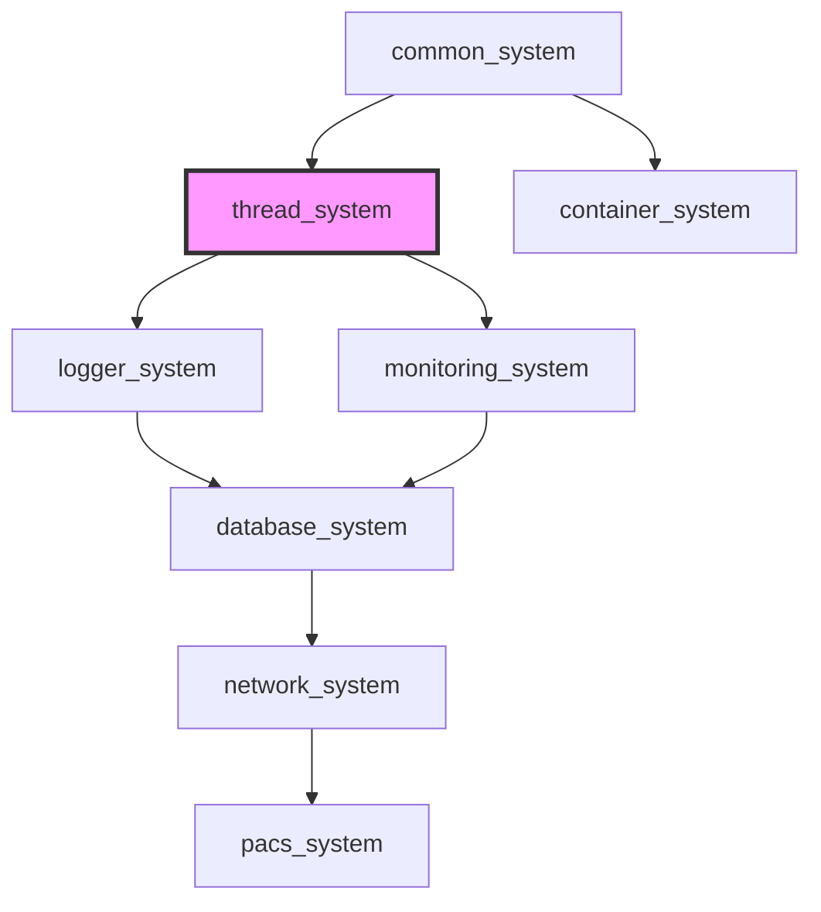

[](https://github.com/kcenon/thread_system/actions/workflows/ci.yml)
[](https://github.com/kcenon/thread_system/actions/workflows/coverage.yml)
[](https://codecov.io/gh/kcenon/thread_system)
[](https://codecov.io/gh/kcenon/thread_system)
[](https://github.com/kcenon/thread_system/actions/workflows/static-analysis.yml)
[](https://github.com/kcenon/thread_system/actions/workflows/build-Doxygen.yaml)
[](https://github.com/kcenon/thread_system/blob/main/LICENSE)

# Thread System

> **Language:** **English** | [한국어](README.kr.md)

A modern C++20 multithreading framework designed to democratize concurrent programming.

## Table of Contents

- [Overview](#overview)
- [Quick Start](#quick-start)
- [Core Features](#core-features)
- [Performance Highlights](#performance-highlights)
- [Architecture Overview](#architecture-overview)
- [Documentation](#documentation)
- [Ecosystem Integration](#ecosystem-integration)
- [C++20 Module Support](#c20-module-support)
- [CMake Integration](#cmake-integration)
- [Examples](#examples)
- [Production Quality](#production-quality)
- [Platform Support](#platform-support)
- [Contributing](#contributing)
- [License](#license)

---

## Overview

Thread System is a comprehensive multithreading framework that provides intuitive abstractions and robust implementations for building high-performance, thread-safe applications.

**Key Value Propositions**:
- **Well-Tested**: 94% CI success rate over the last 100 ci.yml runs (2026-03-19 to 2026-04-15, measured 2026-09-13), 49% code coverage
- **High Performance**: 1.16M jobs/second baseline, 4x faster lock-free queues, adaptive optimization
- **Developer Friendly**: Intuitive API, comprehensive documentation, rich examples
- **Flexible Architecture**: Modular design with optional logger/monitoring integration
- **Cross-Platform**: Linux, macOS, Windows support with multiple compilers

**Latest Updates**:
- ✅ Queue API simplified: 8 implementations → 2 public types (adaptive_job_queue, job_queue)
- ✅ Hazard Pointer implementation completed - lock-free queue safe for production
- ✅ 4x performance improvement with lock-free queue (71 μs vs 291 μs)
- ✅ Enhanced synchronization primitives and cancellation tokens

---

## Quick Start

### Requirements

- **C++20 Compiler**: GCC 13+ / Clang 17+ / MSVC 2022+ (`std::format` is required; configuration fails without it)
- **CMake 3.20+**
- **[common_system](https://github.com/kcenon/common_system)**: Required dependency (must be cloned alongside thread_system)

> **⚠️ Downstream Impact**: Systems that depend on thread_system (monitoring_system, database_system, network_system) inherit these compiler requirements. When building the full ecosystem, ensure your compiler meets GCC 13+/Clang 17+.

### Installation

```bash
# Clone repositories (common_system is required)
git clone https://github.com/kcenon/common_system.git
git clone https://github.com/kcenon/thread_system.git
cd thread_system

# Install dependencies
./scripts/dependency.sh  # Linux/macOS
./scripts/dependency.bat # Windows

# Build
./scripts/build.sh       # Linux/macOS
./scripts/build.bat      # Windows

# Run examples
./build/bin/minimal_thread_pool
```

### Installation via vcpkg

`kcenon-thread-system` is published in the [kcenon vcpkg registry](https://github.com/kcenon/vcpkg-registry), not in the official vcpkg registry. Use manifest mode and add the kcenon registry in `vcpkg-configuration.json`:

```json
{
  "default-registry": {
    "kind": "builtin",
    "baseline": "d90a9b159c08169f39adcd1b0f1ac0ca12c4b96c"
  },
  "registries": [
    {
      "kind": "git",
      "repository": "https://github.com/kcenon/vcpkg-registry.git",
      "baseline": "40632164c62b2256579a27eda228c48b057cbee9",
      "packages": ["kcenon-*"]
    }
  ]
}
```

Declare the dependency in `vcpkg.json`:

```json
{
  "dependencies": [
    "kcenon-thread-system"
  ]
}
```

Configure with the vcpkg toolchain file:

```bash
cmake -B build -DCMAKE_TOOLCHAIN_FILE="$VCPKG_ROOT/scripts/buildsystems/vcpkg.cmake"
cmake --build build
```

In your `CMakeLists.txt`:
```cmake
find_package(thread_system CONFIG REQUIRED)
target_link_libraries(your_target PRIVATE thread_system::thread_system)
```

The kcenon registry currently provides 0.3.2; v1.0.0 has not been published there yet. Use [FetchContent](#with-fetchcontent) to build against v1.0.0.

### Basic Usage

```cpp
#include <kcenon/thread/core/thread_pool.h>
#include <kcenon/thread/core/thread_worker.h>

#include <algorithm>
#include <future>
#include <iostream>
#include <memory>
#include <thread>
#include <vector>

using namespace kcenon::thread;

int main() {
    // Create thread pool
    auto pool = std::make_shared<thread_pool>("MyPool");

    // Add workers
    std::vector<std::unique_ptr<thread_worker>> workers;
    const unsigned worker_count = std::max(1u, std::thread::hardware_concurrency());
    for (unsigned i = 0; i < worker_count; ++i) {
        workers.push_back(std::make_unique<thread_worker>());
    }
    if (auto r = pool->enqueue_batch(std::move(workers)); r.is_err()) {
        std::cerr << "enqueue_batch failed: " << r.error().message << "\n";
        return 1;
    }

    // Start processing
    if (auto r = pool->start(); r.is_err()) {
        std::cerr << "start failed: " << r.error().message << "\n";
        return 1;
    }

    // Submit tasks; submit() returns a future for each result
    std::vector<std::future<int>> results;
    for (int i = 0; i < 1000; ++i) {
        results.push_back(pool->submit([i] { return i * 2; }));
    }

    long long total = 0;
    for (auto& f : results) {
        total += f.get();
    }
    std::cout << "Sum of results: " << total << "\n";  // 999000

    // Clean shutdown: stop(false) lets running jobs finish but does not run
    // jobs that are still queued, so the results are collected first (above).
    if (auto r = pool->stop(); r.is_err()) {
        std::cerr << "stop failed: " << r.error().message << "\n";
        return 1;
    }
    return 0;
}
```

**📖 [Full Getting Started Guide →](docs/guides/QUICK_START.md)**

---

## Core Features

### Thread Pool System
- **Standard Thread Pool**: Multi-worker pool with adaptive queue support
- **Typed Thread Pool**: Priority-based scheduling with type-aware routing
- **Dynamic Worker Management**: Add/remove workers at runtime
- **Dual API**: Result-based (detailed errors) and convenience API (simple)

### Queue Implementations (Simplified to 2 Public Types)
Following Kent Beck's Simple Design principle, we now offer only 2 public queue types:
- **Adaptive Queue** (Recommended): Auto-optimizing queue that switches between mutex and lock-free modes
- **Standard Queue**: Mutex-based FIFO with blocking wait and exact size tracking (supports optional size limits)
- **Queue Factory**: Requirements-based queue creation with compile-time selection
- **Capability Introspection**: Runtime query for queue characteristics (exact_size, lock_free, etc.)

> **Note**: `bounded_job_queue` is now merged into `job_queue` with optional `max_size` parameter.
> Internal implementations (`lockfree_job_queue`, `concurrent_queue`) are in `detail::` namespace.

### Advanced Features
- **Hazard Pointers**: Safe memory reclamation for lock-free structures
- **Cancellation Tokens**: Cooperative cancellation with hierarchical support
- **Service Registry**: Lightweight dependency injection container
- **Synchronization Primitives**: Enhanced wrappers with timeouts and predicates
- **Worker Policies**: Fine-grained control (scheduling, idle behavior, CPU affinity)

### Error Handling
- Public APIs return `kcenon::common::Result<T>` or `kcenon::common::VoidResult`. Check `is_err()` and read `error().message`, as the Quick Start does.
- Thread-specific error codes and helpers such as `get_error_code(...)` are in `include/kcenon/thread/core/error_handling.h`.
- The former `thread::result<T>`, `thread::result_void`, and `thread::error` types have been removed.

**📚 [Detailed Features →](docs/FEATURES.md)**

---

## Performance Highlights

**Platform**: Apple M1 @ 3.2GHz, 16GB RAM, macOS Sonoma

| Metric | Value | Configuration |
|--------|-------|---------------|
| **Production Throughput** | 1.16M jobs/s | 10 workers, real workload |
| **Typed Pool** | 1.24M jobs/s | 6 workers, 6.9% faster |
| **Lock-free Queue** | 71 μs/op | 4x faster than mutex |
| **Job Latency (P50)** | 77 ns | Sub-microsecond |
| **Memory Baseline** | <1 MB | 8 workers |
| **Scaling Efficiency** | 96% | Up to 8 workers |

### Queue Performance Comparison

| Queue Type | Latency | Best For |
|-----------|---------|----------|
| Mutex Queue | 96 ns | Low contention (1-2 threads) |
| Adaptive (auto) | 96-320 ns | Variable workload |
| Lock-free | 320 ns | High contention (8+ threads), 37% faster |

### Worker Scaling

| Workers | Speedup | Efficiency | Rating |
|---------|---------|------------|--------|
| 2 | 2.0x | 99% | 🥇 Excellent |
| 4 | 3.9x | 97.5% | 🥇 Excellent |
| 8 | 7.7x | 96% | 🥈 Very Good |
| 16 | 15.0x | 94% | 🥈 Very Good |

**⚡ [Full Benchmarks →](docs/BENCHMARKS.md)**

---

## Architecture Overview

### Modular Design

```
┌─────────────────────────────────────────┐
│         Thread System Core              │
│  ┌───────────────────────────────────┐  │
│  │  Thread Pool & Workers            │  │
│  │  - Standard Pool                  │  │
│  │  - Typed Pool (Priority)          │  │
│  │  - Dynamic Worker Management      │  │
│  └───────────────────────────────────┘  │
│  ┌───────────────────────────────────┐  │
│  │  Queue Implementations            │  │
│  │  - Adaptive Queue (recommended)   │  │
│  │  - Standard Queue (blocking wait) │  │
│  │  - Internal: lock-free MPMC       │  │
│  └───────────────────────────────────┘  │
│  ┌───────────────────────────────────┐  │
│  │  Advanced Features                │  │
│  │  - Hazard Pointers                │  │
│  │  - Cancellation Tokens            │  │
│  │  - Service Registry               │  │
│  │  - Worker Policies                │  │
│  └───────────────────────────────────┘  │
└─────────────────────────────────────────┘

Optional Integration Projects (Separate Repos):
┌──────────────────┐  ┌──────────────────┐
│  Logger System   │  │ Monitoring System│
│  - Async logging │  │ - Real-time      │
│  - Multi-target  │  │   metrics        │
│  - High-perf     │  │ - Observability  │
└──────────────────┘  └──────────────────┘
```

### Key Components

- **thread_base**: Abstract thread class with lifecycle management
- **thread_pool**: Multi-worker pool with adaptive queues
- **typed_thread_pool**: Priority scheduling with type-aware routing
- **adaptive_job_queue**: Auto-optimizing queue (recommended default)
- **job_queue**: Mutex-based queue with blocking wait support
- **hazard_pointer**: Safe memory reclamation for lock-free structures
- **cancellation_token**: Cooperative cancellation mechanism

**🏗️ [Architecture Guide →](docs/advanced/ARCHITECTURE.md)**

---

## Documentation

### Getting Started
- 📖 [Quick Start Guide](docs/guides/QUICK_START.md) - Get up and running in 5 minutes
- 🔧 [Build Guide](docs/guides/BUILD_GUIDE.md) - Detailed build instructions
- 🚀 [User Guide](docs/advanced/USER_GUIDE.md) - Comprehensive usage guide

### Core Documentation
- 📚 [Features](docs/FEATURES.md) - Detailed feature descriptions
- ⚡ [Benchmarks](docs/BENCHMARKS.md) - Comprehensive performance data
- 📋 [API Reference](docs/advanced/API_REFERENCE.md) - Complete API documentation
- 🏛️ [Architecture](docs/advanced/ARCHITECTURE.md) - System design and internals

### Advanced Topics
- 🔬 [Performance Baseline](docs/performance/BASELINE.md) - Baseline metrics and regression detection
- 🛡️ [Production Quality](docs/PRODUCTION_QUALITY.md) - CI/CD, testing, quality metrics
- 🧩 [C++20 Concepts](docs/advanced/CPP20_CONCEPTS.md) - Type-safe constraints for thread operations
- 📁 [Project Structure](docs/PROJECT_STRUCTURE.md) - Detailed codebase organization
- ⚠️ [Known Issues](docs/advanced/KNOWN_ISSUES.md) - Current limitations and workarounds
- 📗 [Queue Selection Guide](docs/advanced/QUEUE_SELECTION_GUIDE.md) - Choosing the right queue
- 🔄 [Queue Backward Compatibility](docs/QUEUE_BACKWARD_COMPATIBILITY.md) - Migration and compatibility

### Development
- 🤝 [Contributing](docs/contributing/CONTRIBUTING.md) - How to contribute
- 🔍 [Troubleshooting](docs/guides/TROUBLESHOOTING.md) - Common issues and solutions
- ❓ [FAQ](docs/guides/FAQ.md) - Frequently asked questions
- 🔄 [Migration Guide](docs/advanced/MIGRATION.md) - Upgrade from older versions

### API Documentation (Doxygen)

```bash
cmake -S . -B build -DCMAKE_BUILD_TYPE=Release
cmake --build build --target docs
# Open documents/html/index.html
```

---

## Ecosystem Integration

### Ecosystem Dependency Map



> **Ecosystem reference**:
> [common_system](https://github.com/kcenon/common_system) — Tier 0: IExecutor interface and Result&lt;T&gt; pattern
> [logger_system](https://github.com/kcenon/logger_system) — Tier 2: Async logging (optional consumer)
> [monitoring_system](https://github.com/kcenon/monitoring_system) — Tier 3: Metrics collection (consumer)
> [network_system](https://github.com/kcenon/network_system) — Tier 4: Transport layer (consumer)

### Project Ecosystem

This project is part of a modular ecosystem:

```
thread_system (core interfaces)
    ↑                    ↑
logger_system    monitoring_system
```

### Optional Components

- **[logger_system](https://github.com/kcenon/logger_system)**: High-performance asynchronous logging
- **[monitoring_system](https://github.com/kcenon/monitoring_system)**: Real-time metrics and monitoring
- **[integration_example](examples/integration_example)**: Thread-pool integration example with mock ILogger/IMonitor services (built by default)

### Integration Benefits

- **Plug-and-play**: Use only the components you need
- **Interface-driven**: Clean abstractions enable easy swapping
- **Performance-optimized**: Each system optimized for its domain
- **Unified ecosystem**: Consistent API design

**🌐 [Ecosystem Integration Guide →](docs/ECOSYSTEM.md)**

---

## C++20 Module Support

Thread System provides C++20 module support as an alternative to the header-based interface.

### Requirements for Modules
- **CMake 3.28+**
- **Clang 16+, GCC 14+, or MSVC 2022 17.4+**
- **common_system** with module support

### Building with Modules

```bash
cmake -B build -DTHREAD_BUILD_MODULES=ON
cmake --build build
```

### Using Modules

```cpp
// Instead of includes:
// #include <kcenon/thread/core/thread_pool.h>

// Use module import:
import kcenon.thread;

int main() {
    using namespace kcenon::thread;

    auto pool = std::make_shared<thread_pool>("MyPool");
    pool->start();
    // ...
}
```

### Module Structure

| Module | Contents |
|--------|----------|
| `kcenon.thread` | Primary module (imports all partitions) |
| `kcenon.thread:core` | Thread pool, workers, jobs, cancellation |
| `kcenon.thread:queue` | Queue implementations (job_queue, adaptive_job_queue) |

> **Note**: C++20 modules are experimental. The header-based interface remains the primary API.

---

## CMake Integration

### Basic Integration

```cmake
# Using as subdirectory. Add common_system first: thread_system links
# kcenon::common_system when that target exists.
add_subdirectory(common_system)
add_subdirectory(thread_system)

target_link_libraries(your_target PRIVATE thread_system)
```

thread_system links the `kcenon::common_system` target when it exists (common_system `main` defines it); otherwise it exports the include directory of the common_system headers it found, such as a sibling checkout.

### With FetchContent

thread_system does not fetch common_system itself. Fetch common_system first and point `COMMON_SYSTEM_INCLUDE_DIR` at its headers. This example pins thread_system v1.0.0 with common_system v0.2.0:

```cmake
include(FetchContent)
FetchContent_Declare(
    common_system
    GIT_REPOSITORY https://github.com/kcenon/common_system.git
    GIT_TAG v0.2.0
)
FetchContent_MakeAvailable(common_system)
set(COMMON_SYSTEM_INCLUDE_DIR "${common_system_SOURCE_DIR}/include")

FetchContent_Declare(
    thread_system
    GIT_REPOSITORY https://github.com/kcenon/thread_system.git
    GIT_TAG v1.0.0  # Pin to a specific release tag; do NOT use main
)
FetchContent_MakeAvailable(thread_system)

target_link_libraries(your_target PRIVATE thread_system)
```

### With vcpkg

See [Installation via vcpkg](#installation-via-vcpkg) for the registry configuration, the manifest, and the CMake target.

> **Note**: `kcenon-thread-system` depends on `kcenon-common-system`; vcpkg installs it automatically from the kcenon registry (the port is also in the official vcpkg registry). A vcpkg install needs no separate common_system checkout.

The `testing`, `logging`, and `development` features in this repository's `vcpkg.json` apply only when building thread_system itself in manifest mode; the published port declares no features.

---

## Examples

### Sample Applications

- **[minimal_thread_pool](examples/minimal_thread_pool)**: Basic thread pool usage without a logger dependency
- **[typed_thread_pool_sample](examples/typed_thread_pool_sample)**: Priority-based task scheduling (source only; not built by default)
- **[adaptive_queue_sample](examples/adaptive_queue_sample)**: Queue performance comparison
- **[queue_factory_sample](examples/queue_factory_sample)**: Requirements-based queue creation
- **[queue_capabilities_sample](examples/queue_capabilities_sample)**: Runtime capability introspection
- **[hazard_pointer_sample](examples/hazard_pointer_sample)**: Lock-free memory reclamation (source only; not built by default)
- **[integration_example](examples/integration_example)**: Thread-pool integration with mock ILogger/IMonitor services

### Running Examples

```bash
# Build all examples
cmake -B build
cmake --build build

# Run specific example
./build/bin/minimal_thread_pool
./build/bin/adaptive_queue_sample
```

---

## Production Quality

### Quality Metrics

- ✅ **94% CI Success Rate** over the last 100 ci.yml runs (2026-03-19 to 2026-04-15, measured 2026-09-13)
- ✅ **49% Code Coverage** with comprehensive test suite
- ✅ **Zero ThreadSanitizer Warnings** in production code
- ✅ **Zero AddressSanitizer Leaks** - 100% RAII compliance
- ✅ **Multi-Platform Support**: Linux, macOS, Windows
- ✅ **Multiple Compilers**: GCC 13+, Clang 17+, MSVC 2022+

### Thread Safety

**70+ Thread Safety Tests** covering:
- Single producer/consumer
- Multi-producer/multi-consumer (MPMC)
- Adaptive queue mode switching
- Edge cases (shutdown, overflow, underflow)

**ThreadSanitizer**: The `Sanitizer / thread` job in [`.github/workflows/ci.yml`](.github/workflows/ci.yml) runs the unit-test executables (`*_unit`) under ThreadSanitizer, with nine known-issue exclusions listed in the workflow; see [CI Verification Gates](docs/contributing/VERIFICATION_GATES.md).

### Resource Management

**RAII Compliance: Grade A**
- 100% smart pointer usage
- No manual memory management
- Exception-safe cleanup
- Zero memory leaks (AddressSanitizer verified)

**🛡️ [Production Quality Details →](docs/PRODUCTION_QUALITY.md)**

---

## Platform Support

### Supported Platforms

| Platform | Compilers | Status |
|----------|-----------|--------|
| **Linux** | GCC 13+, Clang 17+ | ✅ Fully supported |
| **macOS** | Apple Clang (Xcode with `std::format`; CI: `macos-latest`) | ✅ Fully supported |
| **Windows** | MSVC 2022+ | ✅ Fully supported |

### Architecture Support

| Architecture | Status |
|--------------|--------|
| x86-64 | ✅ Fully supported |
| ARM64 (Apple Silicon, Graviton) | ✅ Fully supported |
| ARMv7 | ⚠️ Untested |
| RISC-V | ⚠️ Untested |

---

## Contributing

We welcome contributions! Please see our [Contributing Guide](docs/contributing/CONTRIBUTING.md) for details.

### Development Workflow

1. Fork the repository
2. Create feature branch (`git checkout -b feature/amazing-feature`)
3. Make changes with tests
4. Run tests locally (`ctest --verbose`)
5. Commit changes (`git commit -m 'Add amazing feature'`)
6. Push to branch (`git push origin feature/amazing-feature`)
7. Open Pull Request

### Code Standards

- Follow modern C++ best practices
- Use RAII and smart pointers
- Write comprehensive unit tests
- Maintain consistent formatting (clang-format)
- Update documentation

---

## Support

- **Issues**: [GitHub Issues](https://github.com/kcenon/thread_system/issues)
- **Email**: kcenon@naver.com

---

## License

This project is licensed under the BSD 3-Clause License - see the [LICENSE](LICENSE) file for details.

---

## Acknowledgments

- Inspired by modern concurrent programming patterns and best practices
- Built with C++20 features (GCC 13+, Clang 17+, MSVC 2022+) for maximum performance and safety
- Maintained by kcenon@naver.com

---

<p align="center">
  Made with ❤️ by 🍀☀🌕🌥 🌊
</p>
