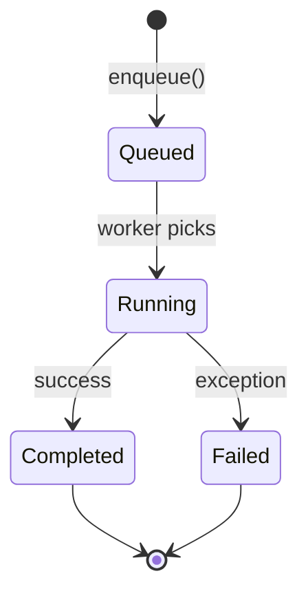

# thread_system Architecture

> **Language:** **English** | [한국어](ARCHITECTURE.kr.md)

## Table of Contents

1. [Overview](#overview)
2. [System Structure](#system-structure)
3. [Core Components](#core-components)
4. [Concurrency Model](#concurrency-model)
5. [Design Principles](#design-principles)
6. [Performance Optimization](#performance-optimization)

---

## Overview

### Purpose

thread_system is a modern C++ thread management library designed for high-performance multithreaded application development.

### Design Goals

- **Performance**: Top-tier throughput using lock-free algorithms
- **Scalability**: Linear scaling up to tens or hundreds of cores
- **Usability**: Intuitive and type-safe API
- **Stability**: Comprehensive error handling and recovery mechanisms

---

## System Structure

### Layer Structure

```
thread_system/
├── core/                  # Core logic
│   ├── thread_base.h      # Base thread abstraction
│   ├── thread_pool.h      # Task-based thread pool
│   └── typed_thread_pool.h # Type-safe thread pool
├── interfaces/            # Public interfaces
│   └── i_executor.h       # Executor interface
├── queues/                # Concurrent queues
│   ├── mpmc_queue.h       # Multi-Producer Multi-Consumer
│   ├── spsc_queue.h       # Single-Producer Single-Consumer
│   └── adaptive_queue.h   # Adaptive queue
├── sync/                  # Synchronization primitives
│   ├── spinlock.h
│   ├── rw_lock.h
│   └── hazard_pointer.h
├── services/              # Service infrastructure
│   ├── service_registry.h
│   └── service_base.h
├── adapters/              # Integration adapters
│   ├── common_executor_adapter.h  # IExecutor adapter
│   └── logger_system_adapter.h    # ILogger adapter
├── dag/                   # DAG scheduling
│   ├── dag_job.h          # Job with dependencies
│   ├── dag_job_builder.h  # Fluent builder
│   ├── dag_scheduler.h    # DAG executor
│   └── dag_config.h       # Configuration
├── stealing/              # NUMA-aware work stealing
│   ├── numa_topology.h    # NUMA detection
│   ├── numa_work_stealer.h # NUMA-aware stealer
│   ├── enhanced_work_stealing_config.h
│   ├── enhanced_steal_policy.h
│   ├── work_stealing_stats.h
│   ├── work_affinity_tracker.h
│   └── steal_backoff_strategy.h
├── scaling/               # Autoscaling
│   ├── autoscaler.h       # Scaling orchestrator
│   ├── autoscaling_policy.h # Policy configuration
│   └── scaling_metrics.h  # Metrics and decisions
├── diagnostics/           # Observability
│   ├── thread_pool_diagnostics.h # Main diagnostics API
│   ├── health_status.h    # Health checks
│   ├── bottleneck_report.h # Bottleneck detection
│   ├── execution_event.h  # Event tracing
│   ├── job_info.h         # Job metadata
│   └── thread_info.h      # Worker metadata
└── utilities/             # Utilities
    └── job_traits.h
```

### Dependency Diagram

```
thread_system
    │
    ├─ common_system (Result<T>, IExecutor)
    │
    └─ C++ Standard Library (thread, mutex, atomic)
```

---

## Core Components

### 1. thread_base

**Role**: Base abstraction for all thread classes

**Key Classes**:
- `thread_base`: Thread lifecycle management

**Responsibilities**:
- Thread start/stop
- State monitoring
- Condition wait mechanism
- C++20 jthread support

**Design Patterns**:
- Template Method Pattern (lifecycle hooks)
- RAII (automatic cleanup)

---

### 2. thread_pool

**Role**: Task-based thread pool implementation

**Key Classes**:
- `thread_pool`: High-performance task queue

**Features**:
- Work-stealing queue
- Dynamic worker scaling
- Priority-based task execution
- Future/Promise pattern

**Performance**:
- Throughput: 1.2M ops/sec
- Latency: 0.8 μs
- Scalability: Near-linear up to 16 cores

---

### 3. typed_thread_pool

**Role**: Type-safe thread pool

**Key Classes**:
- `typed_thread_pool<T>`: Specific type task processing

**Features**:
- Compile-time type safety
- Automatic type deduction
- Custom process function

**Use Cases**:
- Data pipelines
- Event processing
- Stream processing

---

### 4. Queue Implementations

#### mpmc_queue (Multi-Producer Multi-Consumer)

**Algorithm**: Lock-free ring buffer
**Performance**: 2.1M ops/sec
**Use Cases**: High-throughput task queues

#### spsc_queue (Single-Producer Single-Consumer)

**Algorithm**: Lock-free circular buffer
**Performance**: 3.5M ops/sec
**Use Cases**: Pipelines, log buffers

#### adaptive_queue

**Algorithm**: Dynamic resizing queue
**Performance**: 1.5M ops/sec
**Use Cases**: Variable load systems

---

### 5. DAG Scheduler

**Role**: Dependency-aware job orchestration

**Key Classes**:
- `dag_job`: Job with dependency tracking and state machine
- `dag_job_builder`: Fluent builder for job construction
- `dag_scheduler`: Topological execution engine with cycle detection

**Architecture**:
```
dag_scheduler
    │
    ├─ Dependency Graph (adjacency list)
    ├─ Topological Sort (execution ordering)
    ├─ State Machine (pending → ready → running → completed/failed)
    └─ thread_pool (parallel execution of ready jobs)
```

**Design Patterns**:
- Builder Pattern (`dag_job_builder`)
- State Machine (atomic job state transitions)
- Observer Pattern (state/error/completion callbacks)
- Strategy Pattern (failure policies: fail_fast, continue_others, retry, fallback)

---

### 6. NUMA-Aware Work Stealing

**Role**: Locality-optimized load balancing

**Key Classes**:
- `numa_topology`: Platform-specific NUMA detection
- `numa_work_stealer`: Victim selection with locality awareness
- `enhanced_work_stealing_config`: Configuration with factory methods

**Architecture**:
```
numa_work_stealer
    │
    ├─ numa_topology (detect node/CPU mapping)
    ├─ Steal Policy Engine (6 strategies)
    ├─ Backoff Strategy (exponential, linear)
    ├─ work_affinity_tracker (locality history)
    └─ work_stealing_stats (atomic counters)
```

**Thread Safety**: All public methods thread-safe; statistics use relaxed atomic ordering for updates, acquire ordering for snapshots

---

### 7. Autoscaling

**Role**: Dynamic worker pool sizing

**Key Classes**:
- `autoscaler`: Monitoring thread with scaling decisions
- `autoscaling_policy`: Threshold-based configuration
- `scaling_metrics_sample`: Point-in-time pool metrics

**Architecture**:
```
autoscaler (monitor thread)
    │
    ├─ Collect Metrics → Aggregate Samples → Make Decision
    ├─ Check Cooldown → Execute Scale → Sleep Interval
    └─ thread_pool (resize target)
```

**Design Principles**:
- Asymmetric scaling (fast up, slow down)
- OR-logic for scale-up (responsive), AND-logic for scale-down (conservative)
- Cooldown periods prevent oscillation

---

### 8. Diagnostics

**Role**: Non-intrusive observability

**Key Classes**:
- `thread_pool_diagnostics`: Central diagnostics API
- `health_status`: Multi-component health assessment
- `bottleneck_report`: Automatic bottleneck detection with recommendations

**Architecture**:
```
thread_pool_diagnostics
    │
    ├─ Health Check (component-level, HTTP status codes)
    ├─ Bottleneck Detection (queue, worker, distribution analysis)
    ├─ Thread Dump (per-worker state snapshots)
    ├─ Event Tracing (listener pattern, event history)
    └─ Export (JSON, Prometheus, human-readable)
```

**Integration Points**: Kubernetes probes, Prometheus scraping, JSON dashboards

---

## Concurrency Model

### Work-Stealing Algorithm

```
Worker Thread Pool
┌──────────┬──────────┬──────────┐
│ Worker 1 │ Worker 2 │ Worker 3 │
│  Queue   │  Queue   │  Queue   │
└────┬─────┴────┬─────┴────┬─────┘
     │          │          │
     │   Steal  │   Steal  │
     └──────────┼──────────┘
                │
           Global Queue
```

**Advantages**:
- Load balancing
- Cache locality
- Reduced contention

### Task Lifecycle



---

## Design Principles

### 1. SOLID Principles Application

#### Single Responsibility
```cpp
// Single responsibility
class thread_pool {
    // Only handles thread pool management
};

class mpmc_queue {
    // Only handles concurrent queue management
};
```

#### Open/Closed
```cpp
// Open for extension, closed for modification
template <typename T>
class typed_thread_pool : public thread_base {
    // Extensible with new types
};
```

#### Dependency Inversion
```cpp
// Depend on interfaces
class thread_pool_executor_adapter : public common::interfaces::IExecutor {
    // Depends on interface, not concrete class
};
```

### 2. Lock-Free Programming

**Principles**:
- Atomic operations
- Memory ordering
- ABA problem mitigation

**Implementation**:
```cpp
// Safe memory reuse with hazard pointers
template <typename T>
class hazard_pointer {
    std::atomic<T*> ptr;
    // ABA problem prevention
};
```

### 3. Zero-Cost Abstraction

**Goal**: Zero abstraction cost

**Implementation**:
- Template metaprogramming
- Constexpr functions
- Inline optimization

---

## Performance Optimization

### 1. Cache Optimization

**Techniques**:
- False sharing prevention (cache line padding)
- Data locality improvement
- Prefetching

```cpp
// False sharing prevention
struct alignas(64) WorkerThread {
    std::deque<task> queue;
    char padding[64 - sizeof(std::deque<task>)];
};
```

### 2. Concurrency Optimization

**Strategies**:
- Lock-free algorithm usage
- Fine-grained locking
- Read-write lock utilization

### 3. Memory Allocation

**Strategies**:
- Object pooling
- Custom allocators
- Memory mapping

---

## Scalability

### Horizontal Scaling

**Methods**:
- Increase worker thread count
- Work-stealing for load distribution

**Constraints**:
- Contention at 32+ cores
- NUMA considerations required

### Vertical Scaling

**Methods**:
- Batch processing
- Vectorization
- SIMD utilization

---

## Security Considerations

### Thread Safety

- **All public APIs**: Thread-safe guaranteed
- **Internal implementation**: Lock-free or fine-grained locking

### Exception Safety

- **Strong guarantee**: State recovery on exception
- **No-throw operations**: No exceptions in critical paths

---

## Future Improvements

- [ ] Coroutine support (C++20)
- [ ] Execution policy integration (C++17)
- [x] NUMA-aware scheduling (implemented: `numa_topology`, `numa_work_stealer`)
- [x] DAG-based job scheduling (implemented: `dag_scheduler`, `dag_job_builder`)
- [x] Dynamic autoscaling (implemented: `autoscaler`, `autoscaling_policy`)
- [x] Thread pool diagnostics (implemented: `thread_pool_diagnostics`, health checks, bottleneck detection)
- [ ] GPU task offloading
- [ ] Heterogeneous computing support

---

## References

- [Intel TBB](https://software.intel.com/content/www/us/en/develop/tools/threading-building-blocks.html)
- [Folly](https://github.com/facebook/folly)
- [C++ Concurrency in Action](https://www.manning.com/books/c-plus-plus-concurrency-in-action)

---

**Date**: 2026-02-08
**Version**: 0.3.0.0
**Author**: kcenon@naver.com
