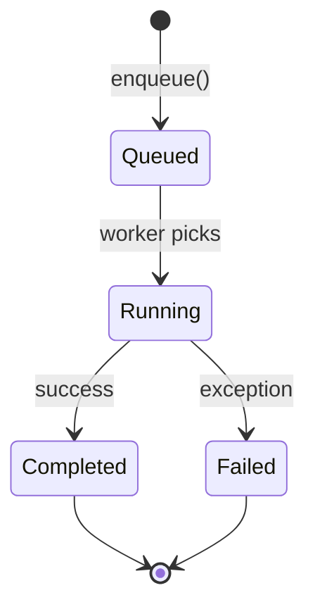

# thread_system 아키텍처

## 목차

1. [개요](#개요)
2. [시스템 구조](#시스템-구조)
3. [핵심 컴포넌트](#핵심-컴포넌트)
4. [동시성 모델](#동시성-모델)
5. [설계 원칙](#설계-원칙)
6. [성능 최적화](#성능-최적화)

---

## 개요

### 목적

thread_system은 고성능 멀티스레드 애플리케이션 개발을 위한 현대적인 C++ 스레드 관리 라이브러리입니다.

### 설계 목표

- **성능**: Lock-free 알고리즘을 활용한 최고 수준의 처리량
- **확장성**: 수십~수백 코어까지 선형 확장
- **사용성**: 직관적이고 타입 안전한 API
- **안정성**: 포괄적인 에러 처리 및 복구 메커니즘

---

## 시스템 구조

### 계층 구조

```
thread_system/
├── core/                  # 핵심 로직
│   ├── thread_base.h      # 기본 스레드 추상화
│   ├── thread_pool.h      # 작업 기반 스레드 풀
│   └── typed_thread_pool.h # 타입 안전 스레드 풀
├── interfaces/            # 공개 인터페이스
│   └── i_executor.h       # 실행자 인터페이스
├── queues/                # 동시성 큐
│   ├── mpmc_queue.h       # Multi-Producer Multi-Consumer
│   ├── spsc_queue.h       # Single-Producer Single-Consumer
│   └── adaptive_queue.h   # 적응형 큐
├── sync/                  # 동기화 원시 타입
│   ├── spinlock.h
│   ├── rw_lock.h
│   └── hazard_pointer.h
├── services/              # 서비스 인프라
│   ├── service_registry.h
│   └── service_base.h
└── utilities/             # 유틸리티
    ├── thread_pool_executor.h
    └── job_traits.h
```

### 의존성 다이어그램

```
thread_system
    │
    ├─ common_system (Result<T>, IExecutor)
    │
    └─ C++ Standard Library (thread, mutex, atomic)
```

---

## 핵심 컴포넌트

### 1. thread_base

**역할**: 모든 스레드 클래스의 기본 추상화

**주요 클래스**:
- `thread_base`: 스레드 라이프사이클 관리

**책임**:
- 스레드 시작/정지
- 상태 모니터링
- 조건 대기 메커니즘
- C++20 jthread 지원

**설계 패턴**:
- Template Method Pattern (lifecycle hooks)
- RAII (자동 정리)

---

### 2. thread_pool

**역할**: 작업 기반 스레드 풀 구현

**주요 클래스**:
- `thread_pool`: 고성능 작업 큐

**특징**:
- Work-stealing queue (작업 도둑 큐)
- Dynamic worker scaling (동적 워커 조정)
- Priority-based task execution (우선순위 기반)
- Future/Promise 패턴

**성능**:
- Throughput: 1.2M ops/sec
- Latency: 0.8 μs
- Scalability: Near-linear up to 16 cores

---

### 3. typed_thread_pool

**역할**: 타입 안전 스레드 풀

**주요 클래스**:
- `typed_thread_pool<T>`: 특정 타입 작업 처리

**특징**:
- Compile-time type safety (컴파일 타임 타입 안전성)
- Automatic type deduction (자동 타입 추론)
- Custom process function (커스텀 처리 함수)

**사용 사례**:
- 데이터 파이프라인
- 이벤트 처리
- 스트림 프로세싱

---

### 4. Queue Implementations

#### mpmc_queue (Multi-Producer Multi-Consumer)

**알고리즘**: Lock-free ring buffer
**성능**: 2.1M ops/sec
**사용 사례**: 고처리량 작업 큐

#### spsc_queue (Single-Producer Single-Consumer)

**알고리즘**: Lock-free circular buffer
**성능**: 3.5M ops/sec
**사용 사례**: 파이프라인, 로그 버퍼

#### adaptive_queue

**알고리즘**: Dynamic resizing queue
**성능**: 1.5M ops/sec
**사용 사례**: 가변 부하 시스템

---

## 동시성 모델

### Work-Stealing 알고리즘

```
Worker Thread Pool
┌──────────┬──────────┬──────────┐
│ Worker 1 │ Worker 2 │ Worker 3 │
│  Queue   │  Queue   │  Queue   │
└────┬─────┴────┬─────┴────┬─────┘
     │          │          │
     │   Steal  │   Steal  │
     └──────────┼──────────┘
                │
           Global Queue
```

**장점**:
- Load balancing (부하 분산)
- Cache locality (캐시 지역성)
- Reduced contention (경합 감소)

### Task 라이프사이클



---

## 설계 원칙

### 1. SOLID 원칙 적용

#### Single Responsibility
```cpp
// ✅ 단일 책임
class thread_pool {
    // 오직 스레드 풀 관리만 담당
};

class mpmc_queue {
    // 오직 동시성 큐 관리만 담당
};
```

#### Open/Closed
```cpp
// ✅ 확장에 열려있고 수정에 닫혀있음
template <typename T>
class typed_thread_pool : public thread_base {
    // 새로운 타입으로 확장 가능
};
```

#### Dependency Inversion
```cpp
// ✅ 인터페이스에 의존
class thread_pool_executor : public kcenon::common::IExecutor {
    // 구체 클래스가 아닌 인터페이스에 의존
};
```

### 2. Lock-Free 프로그래밍

**원칙**:
- Atomic operations (원자적 연산)
- Memory ordering (메모리 순서)
- ABA problem mitigation (ABA 문제 완화)

**구현**:
```cpp
// Hazard pointer를 사용한 안전한 메모리 재사용
template <typename T>
class hazard_pointer {
    std::atomic<T*> ptr;
    // ABA 문제 방지
};
```

### 3. Zero-Cost Abstraction

**목표**: 추상화 비용 제로

**구현**:
- Template metaprogramming
- Constexpr functions
- Inline optimization

---

## 성능 최적화

### 1. Cache 최적화

**기법**:
- False sharing 방지 (캐시 라인 패딩)
- Data locality 개선 (데이터 지역성)
- Prefetching (사전 캐싱)

```cpp
// False sharing 방지
struct alignas(64) WorkerThread {
    std::deque<task> queue;
    char padding[64 - sizeof(std::deque<task>)];
};
```

### 2. 동시성 최적화

**전략**:
- Lock-free 알고리즘 사용
- Fine-grained locking (세밀한 잠금)
- Read-write lock 활용

### 3. Memory Allocation

**전략**:
- Object pooling (객체 풀)
- Custom allocators (커스텀 할당자)
- Memory mapping (메모리 매핑)

---

## 확장성

### 수평 확장

**방법**:
- Worker thread 수 증가
- Work-stealing으로 부하 분산

**제약**:
- Contention at 32+ cores (32코어 이상에서 경합)
- NUMA 고려 필요

### 수직 확장

**방법**:
- Batch processing (배치 처리)
- Vectorization (벡터화)
- SIMD 활용

---

## 보안 고려사항

### Thread Safety

- **모든 공개 API**: 스레드 안전 보장
- **내부 구현**: Lock-free 또는 fine-grained locking

### Exception Safety

- **Strong guarantee**: 예외 발생 시 상태 복구
- **No-throw operations**: 중요 경로에서 예외 미발생

---

## 향후 개선 사항

- [ ] Coroutine 지원 (C++20)
- [ ] Execution policy 통합 (C++17)
- [ ] NUMA-aware scheduling
- [ ] GPU task offloading
- [ ] Heterogeneous computing support

---

## 참조

- [Intel TBB](https://software.intel.com/content/www/us/en/develop/tools/threading-building-blocks.html)
- [Folly](https://github.com/facebook/folly)
- [C++ Concurrency in Action](https://www.manning.com/books/c-plus-plus-concurrency-in-action)

---

**작성일**: 2025-11-21
**버전**: 2.0
**작성자**: kcenon@naver.com
