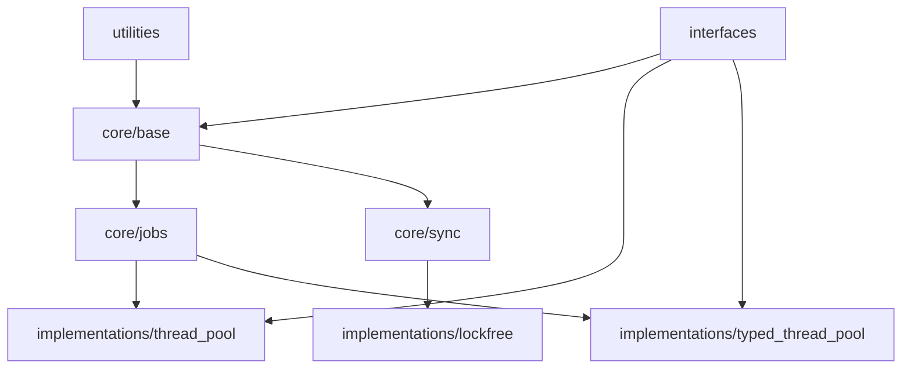

# Thread System — 설계 개선 계획

> **Language:** [English](DESIGN_IMPROVEMENTS.md) | **한국어**

## 날짜
2025년 9월 6일 (Asia/Seoul)

## 개요
이 문서는 프로젝트의 issue tracker에서 추적되는 문제를 해결하기 위한 구조화된 설계 개선 계획을 제시합니다.

## 1. 아키텍처 개선

### 1.1 디렉토리 구조 재구성

#### 현재 문제
- `sources`와 `modular_structure` 디렉토리가 혼재
- `interfaces` 디렉토리의 역할이 불명확
- Module 간 의존성이 명시적이지 않음

#### 제안된 구조
```
thread_system/
├── core/                        # Core module
│   ├── base/                   # thread_base 관련
│   │   ├── include/
│   │   └── src/
│   ├── jobs/                   # job system
│   │   ├── include/
│   │   └── src/
│   └── sync/                   # 동기화 primitive
│       ├── include/
│       └── src/
├── interfaces/                  # public interface
│   ├── logger_interface.h
│   ├── monitoring_interface.h
│   └── thread_context.h
├── implementations/             # 구체적 구현
│   ├── thread_pool/
│   ├── typed_thread_pool/
│   └── lockfree/
├── utilities/                   # 유틸리티
├── tests/                       # 테스트
├── benchmarks/                  # 벤치마크
├── samples/                     # 예제
└── docs/                        # 문서
```

### 1.2 Module 의존성 명확화

#### 의존성 그래프


#### 의존성 규칙
1. 하위 레이어는 상위 레이어에 의존하지 않아야 함
2. 순환 의존성 금지
3. Interface를 통한 의존성 주입 선호

## 2. Interface Layer 강화

### 2.1 새로운 Interface Set

#### Core Interface
```cpp
namespace thread_system {
    // Executor interface
    class executor_interface {
    public:
        virtual ~executor_interface() = default;
        virtual auto execute(std::unique_ptr<job> work) -> result_void = 0;
        virtual auto shutdown() -> result_void = 0;
    };

    // Scheduler interface
    class scheduler_interface {
    public:
        virtual ~scheduler_interface() = default;
        virtual auto schedule(std::unique_ptr<job> work) -> result_void = 0;
        virtual auto get_next_job() -> std::unique_ptr<job> = 0;
    };

    // Monitorable component interface
    class monitorable_interface {
    public:
        virtual ~monitorable_interface() = default;
        virtual auto get_metrics() -> metrics_snapshot = 0;
        virtual auto reset_metrics() -> void = 0;
    };
}
```

### 2.2 Service Registry 패턴

#### 구현 접근 방식
```cpp
class service_registry {
private:
    static inline std::unordered_map<std::type_index, std::any> services_;
    static inline std::shared_mutex mutex_;

public:
    template<typename Interface>
    static auto register_service(std::shared_ptr<Interface> service) -> void {
        std::unique_lock lock(mutex_);
        services_[std::type_index(typeid(Interface))] = service;
    }

    template<typename Interface>
    static auto get_service() -> std::shared_ptr<Interface> {
        std::shared_lock lock(mutex_);
        auto it = services_.find(std::type_index(typeid(Interface)));
        if (it != services_.end()) {
            return std::any_cast<std::shared_ptr<Interface>>(it->second);
        }
        return nullptr;
    }
};
```

## 3. 문서화 시스템 개선

### 3.1 자동 문서 생성

#### Doxygen 통합
```cmake
# CMakeLists.txt 추가 사항
option(BUILD_DOCUMENTATION "Build documentation" ON)

if(BUILD_DOCUMENTATION)
    find_package(Doxygen REQUIRED)

    set(DOXYGEN_GENERATE_HTML YES)
    set(DOXYGEN_GENERATE_MAN NO)
    set(DOXYGEN_OUTPUT_DIRECTORY ${CMAKE_CURRENT_BINARY_DIR}/docs)
    set(DOXYGEN_EXTRACT_ALL YES)
    set(DOXYGEN_EXTRACT_PRIVATE YES)

    doxygen_add_docs(
        docs
        ${CMAKE_CURRENT_SOURCE_DIR}/sources
        COMMENT "Generating API documentation"
    )
endif()
```

### 3.2 문서 구조 표준화

#### Module별 README Template
```markdown
# Module Name

## Overview
Module의 목적과 주요 기능을 설명합니다.

## Architecture
Module의 내부 구조와 설계 원칙.

## API Reference
주요 클래스와 함수를 설명합니다.

## Examples
실제 사용 코드 예제.

## Performance Characteristics
벤치마크 결과 및 최적화 팁.

## Dependencies
필요한 module 및 외부 라이브러리.
```

## 4. 테스팅 및 품질 보증

### 4.1 Coverage Target

#### Coverage 기준
- Code coverage: 최소 80%
- Branch coverage: 최소 70%
- Core module (core): 90% 이상

#### 테스트 자동화
```cmake
# Coverage 측정
if(ENABLE_COVERAGE)
    set(CMAKE_CXX_FLAGS "${CMAKE_CXX_FLAGS} --coverage")
    set(CMAKE_EXE_LINKER_FLAGS "${CMAKE_EXE_LINKER_FLAGS} --coverage")

    add_custom_target(coverage
        COMMAND lcov --capture --directory . --output-file coverage.info
        COMMAND lcov --remove coverage.info '/usr/*' --output-file coverage.info
        COMMAND lcov --list coverage.info
        COMMAND genhtml coverage.info --output-directory coverage_report
        WORKING_DIRECTORY ${CMAKE_BINARY_DIR}
    )
endif()
```

### 4.2 Benchmark 자동화

#### Benchmark Framework
```cpp
class benchmark_suite {
public:
    struct result {
        std::string name;
        double throughput;
        double latency_ns;
        double memory_mb;
    };

    template<typename Func>
    static auto run(const std::string& name, Func&& func, size_t iterations = 1000000) -> result {
        auto start = std::chrono::high_resolution_clock::now();

        for (size_t i = 0; i < iterations; ++i) {
            func();
        }

        auto end = std::chrono::high_resolution_clock::now();
        auto duration = std::chrono::duration_cast<std::chrono::nanoseconds>(end - start);

        return {
            .name = name,
            .throughput = static_cast<double>(iterations) / duration.count() * 1e9,
            .latency_ns = static_cast<double>(duration.count()) / iterations,
            .memory_mb = get_memory_usage_mb()
        };
    }
};
```

## 5. 빌드 시스템 개선

### 5.1 Modular CMake 구성

#### Module별 CMakeLists.txt
```cmake
# core/CMakeLists.txt
add_library(thread_system_core STATIC)

target_sources(thread_system_core
    PRIVATE
        base/src/thread_base.cpp
        jobs/src/job.cpp
        sync/src/sync_primitives.cpp
)

target_include_directories(thread_system_core
    PUBLIC
        $<BUILD_INTERFACE:${CMAKE_CURRENT_SOURCE_DIR}/base/include>
        $<BUILD_INTERFACE:${CMAKE_CURRENT_SOURCE_DIR}/jobs/include>
        $<BUILD_INTERFACE:${CMAKE_CURRENT_SOURCE_DIR}/sync/include>
        $<INSTALL_INTERFACE:include>
)

# Install 규칙
install(TARGETS thread_system_core
    EXPORT thread_system_targets
    LIBRARY DESTINATION lib
    ARCHIVE DESTINATION lib
    RUNTIME DESTINATION bin
)
```

### 5.2 Packaging

#### CMake Package 파일
```cmake
# ThreadSystemConfig.cmake.in
@PACKAGE_INIT@

include("${CMAKE_CURRENT_LIST_DIR}/ThreadSystemTargets.cmake")

check_required_components(ThreadSystem)

# 제공되는 component
set(ThreadSystem_COMPONENTS
    Core
    ThreadPool
    TypedThreadPool
    Utilities
)
```

## 6. 코딩 표준 통일

### 6.1 명명 규칙

#### 통일 규칙
- 클래스: `snake_case` (예: `thread_base`)
- 함수: `snake_case` (예: `get_worker_count`)
- Member 변수: `snake_case_` (예: `worker_count_`)
- Template 클래스: `snake_case` (접미사 불필요)
- Interface: `snake_case_interface` (예: `logger_interface`)

### 6.2 Code Formatter 설정

#### .clang-format 파일
```yaml
BasedOnStyle: Google
IndentWidth: 4
TabWidth: 4
UseTab: Never
ColumnLimit: 100
PointerAlignment: Left
AlignAfterOpenBracket: Align
AllowShortFunctionsOnASingleLine: Empty
BreakConstructorInitializers: BeforeComma
```

## 7. 실행 계획

### Phase 1: 기초 (1주)
1. 디렉토리 레이아웃 재구성
2. CMake 빌드 시스템 개선
3. 기본 문서 template 생성

### Phase 2: Interface 개선 (2주)
1. 새로운 interface 정의
2. Service registry 구현
3. 기존 코드 리팩토링

### Phase 3: 문서화 (1주)
1. Doxygen 통합
2. Module별 README 작성
3. API 문서 생성

### Phase 4: 품질 보증 (2주)
1. Coverage 측정 시스템 구축
2. Benchmark 자동화
3. CI/CD pipeline 개선

### Phase 5: 최종화 (1주)
1. 코드 리뷰 및 수정
2. 최종 문서 검토
3. 릴리스 준비

## 8. 예상 이점

1. **유지 보수성**: 명확한 module 구조와 의존성 관리
2. **확장성**: Interface 기반 설계로 새로운 구현 추가 용이
3. **문서 품질**: 자동 생성 및 표준화된 template
4. **테스트 신뢰성**: Coverage 측정 및 자동화된 테스트
5. **성능 투명성**: 자동화된 benchmark 및 지속적 모니터링
6. **개발자 생산성**: 명확한 가이드라인 및 도구 지원

## 9. 위험 관리

### 잠재적 위험
1. **API 변경**: 기존 사용자 코드와의 호환성 문제
   - 완화: 마이그레이션 가이드 제공; deprecated 표시 사용

2. **성능 저하**: 추가 interface로 인한 오버헤드
   - 완화: Inline 최적화; template 활용

3. **빌드 복잡도 증가**: Modularization으로 인한 빌드 시간 증가
   - 완화: Precompiled header; 병렬 빌드 최적화

## 10. 결론

이 계획은 thread_system 프로젝트의 구조적 문제를 해결하고 장기적인 유지 보수성과 확장성을 보장하기 위한 체계적인 접근 방식을 제공합니다. 단계적 실행을 통해 위험을 최소화하면서 전반적인 품질을 개선할 수 있습니다.
